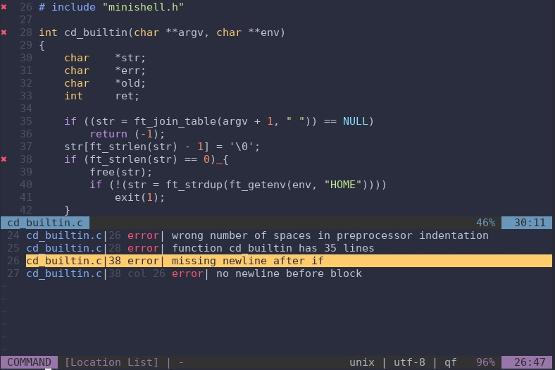

# norminette-vim

42 norminette (linter) for vim



## Installation

norminette-vim needs [syntastic](https://github.com/vim-syntastic/syntastic) and the [norminette](https://github.com/42Paris/norminette) to work.  
You will need a plugin manager to install syntastic and norminette-vim. I recommend [vim-plug](https://github.com/junegunn/vim-plug).  

1. If you are not on a 42 mac, install the [norminette](https://github.com/42Paris/norminette#installing-instructions).
2. Install syntastic and norminette-vim with your plugin manager. See exemple below.

With vim-plug, add this to the beginning of your `~/.vimrc` (or `~/.config/nvim/init.vim` for neovim):
```vim
call plug#begin()

Plug 'vim-syntastic/syntastic'
Plug 'alexandregv/norminette-vim'

call plug#end()
```
then restart vim and run `:PlugInstall`

3. Copy the [configuration](#configuration) to your `~/.vimrc` (or `~/.config/nvim/init.vim` for neovim). Note that **first line is mandatory**.

## Configuration

Here is the configuration I recommend. **You at least need the first line to enable the checker.**
```vim
" Enable norminette-vim (and gcc)
let g:syntastic_c_checkers = ['norminette', 'gcc']
let g:syntastic_aggregate_errors = 1

" Set the path to norminette (do no set if using norminette of 42 mac)
let g:syntastic_c_norminette_exec = '~/.norminette/norminette.rb'

" Pass custom arguments to norminette (this one ignores 42header)
let g:syntastic_c_norminette_args = '-R CheckTopCommentHeader'

" Check errors when opening a file (disable to speed up startup time)
let g:syntastic_check_on_open = 1

" Enable error list
let g:syntastic_always_populate_loc_list = 1

" Automatically open error list
let g:syntastic_auto_loc_list = 1

" Skip check when closing
let g:syntastic_check_on_wq = 0
```

## Usage

Open any `.c` file and you should see your norm errors (if any!).  
You can open the error list with `:Errors`

## Don't want to bother with this syntastic/plugins stuff? Check this

Vim has a native feature (vim-compiler and quickfix) which gives almost the same result. It just lacks the line indicators on the left side and the automatic check / list opening.

1. `git clone https://github.com/alexandregv/norminette-vim ~/.vim/pack/syntax/start/norminette-vim`
2. Open a `.c` file and run `:Norminette`

You can specify norminette path by adding `let g:norminette_exec = '~/.norminette/norminette.rb'` to your `~/.vimrc` (or `~/.config/nvim/init.vim` for neovim).
